## Task 5 : Decision Tree Implementation

### Q1. Complete the decision tree implementation in tree/base.py. The code should be written in Python and not use existing libraries other than the ones shared in class or already imported in the code. Your decision tree should work for four cases: 

1. **Discrete features → Discrete output**  
2. **Discrete features → Real output**  
3. **Real features → Discrete output**  
4. **Real features → Real output**  

Your model should accept real inputs only (for discrete inputs, you may convert the attributes into one-hot encoded vectors). Your decision tree should be able to use InformationGain using Entropy or GiniIndex as the criteria for splitting for discrete output. Your decision tree should be able to use InformationGain using MSE as the criteria for splitting for real output. Your code should also be able to plot/display the decision tree. 

We have successfully implemented the **Decision Tree** in `tree/base.py` according to the assignment requirements.  

### Completed Files:
- **`tree/base.py`** → Contains the completed `DecisionTree` class.  
- **`tree/utils.py`** → Includes utility functions used by the decision tree.  
- **`metrics.py`** → Implements all required performance metric functions.  

### Usage:
To verify the implementation and visualize results, please run **`usage.py`**.

### Q2. Generate your dataset using the following lines of code. 
### a) Show the usage of your decision tree on the above dataset. The first 70% of the data should be used for training purposes and the remaining 30% for test purposes. Show the accuracy, per-class precision and recall of the decision tree you implemented on the test dataset. 
### b) Use 5 fold cross-validation on the dataset. Using nested cross-validation find the optimum depth of the tree. 

Ans : We created the dataset using the code provided    
Shape of X: (100, 2)   
Shape of y: (100,)

Scatter plot of the data
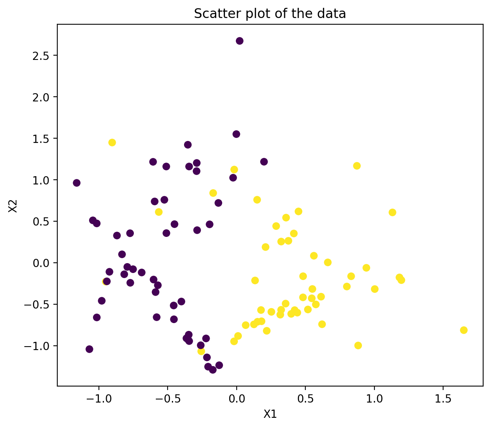

Now we have split the data as 70% for training and remaining 30% for testing purposes.     
Shape of X_train: (70, 2)   
Shape of X_test: (30, 2)   
Shape of y_train: (70,)  
Shape of y_test: (30,)  

### Evaluation Metrics

Below are the results of our implemented Decision Tree on the test dataset: 

Criteria : Information Gain
Accuracy : 0.8667
Precision for class 0 : 0.75
Recall for class 0 : 0.9
Precision for class 1 : 0.9444
Recall for class 1 : 0.85

Here are the accuracies for each of the k-fold cross validation:  
Fold 1/5
Criteria : information_gain
Accuracy : 0.8
Fold 2/5
Criteria : information_gain
Accuracy : 0.9
Fold 3/5
Criteria : information_gain
Accuracy : 0.85
Fold 4/5
Criteria : information_gain
Accuracy : 0.8
Fold 5/5
Criteria : information_gain
Accuracy : 0.95

Average Accuracy: 0.86

### Optimal Tree Depth by Splitting Criterion

| Criterion          | Mean Best Depth |
|--------------------|-----------------|
| Information Gain   | 2.0             |
| Gini Index         | 2.0             |

Plot of outer fold accuracies vs depth for each outer fold
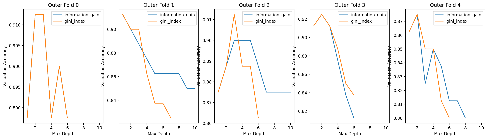

### Q3. a) Show the usage of your decision tree for the automotive efficiency problem. b) Compare the performance of your model with the decision tree module from scikit learn.

**Answer:**  
We first extracted the **Auto-MPG dataset** with a shape of **(398, 8)**.  
After preprocessing, the data was split into training and testing sets.  

We then computed the **RMSE** using both:  
1. Our **custom Decision Tree implementation**  
2. **Scikit-Learn's Decision Tree Regressor**  

### Performance Comparison:
Our Decision Tree - Train RMSE: 3.56416
Our Decision Tree - Test RMSE: 3.67832
Scikit-Learn Decision Tree - Train RMSE: 2.09584
Scikit-Learn Decision Tree - Test RMSE: 3.41111

Scikit-Learn’s decision tree clearly outperforms our custom implementation.

- Training RMSE: custom = 3.5642, scikit-learn = 2.0958

- Test RMSE: custom = 3.6783, scikit-learn = 3.4111

The scikit-learn model fits the training data better—likely due to optimized splitting, pruning, and robust edge-case handling—and it also generalizes more effectively. Our implementation appears to underfit (higher errors on both train and test). Further refinement could improve fit and generalization.

### Q4. Create some fake data to do some experiments on the runtime complexity of your decision tree algorithm. Create a dataset with N samples and M binary features. Vary M and N to plot the time taken for : 1) learning the tree, 2) predicting for test data. How do these results compare with theoretical time complexity for decision tree creation and prediction. You should do the comparison for all the four cases of decision trees.

For varying N:

Plots for information_gain:

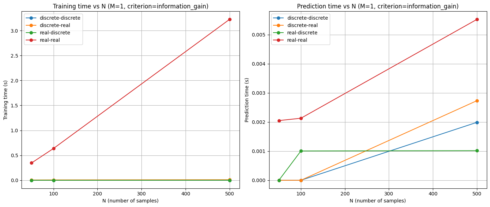

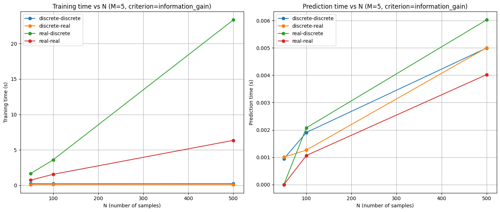

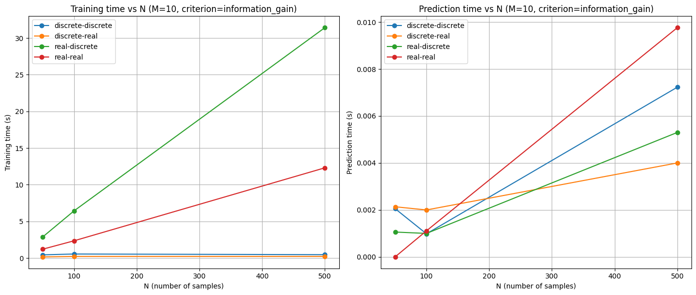

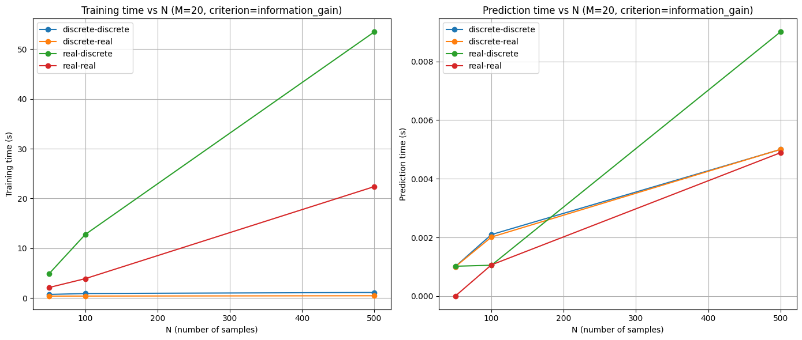

Plots for gini_index:

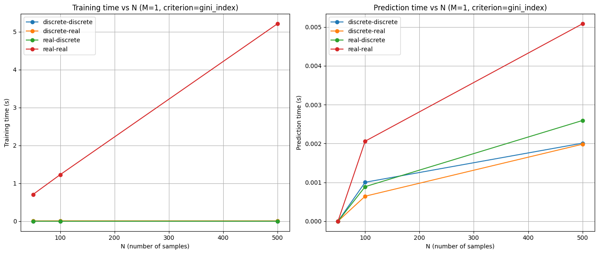

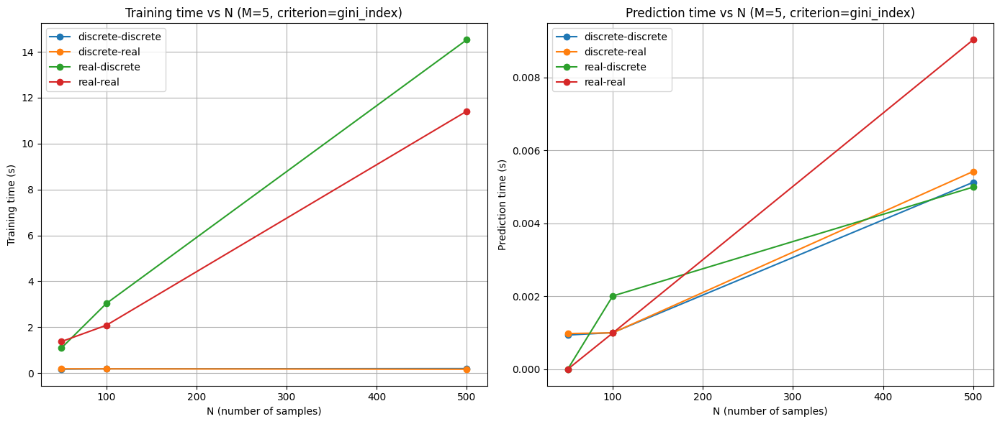

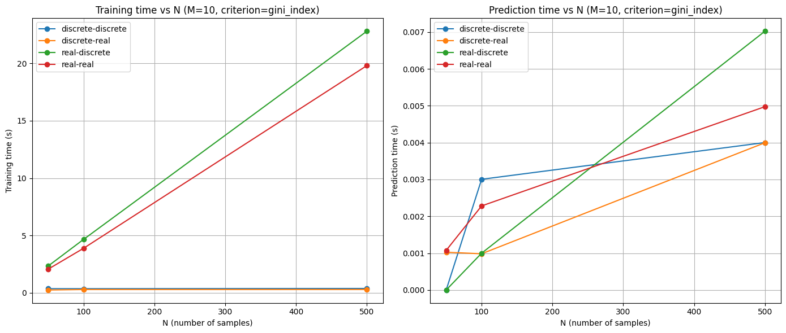

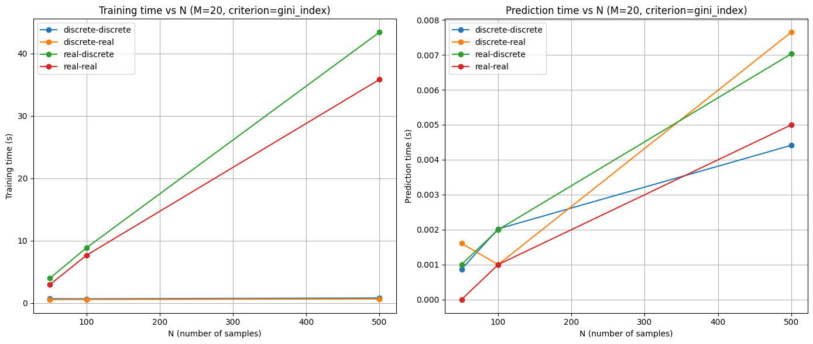

For varying M:

Plots for information_gain:

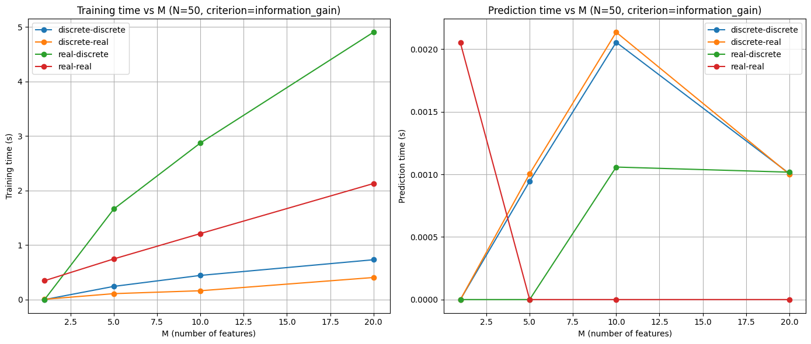

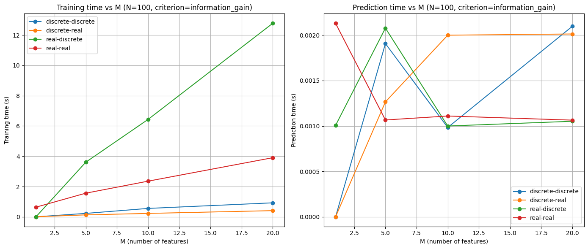

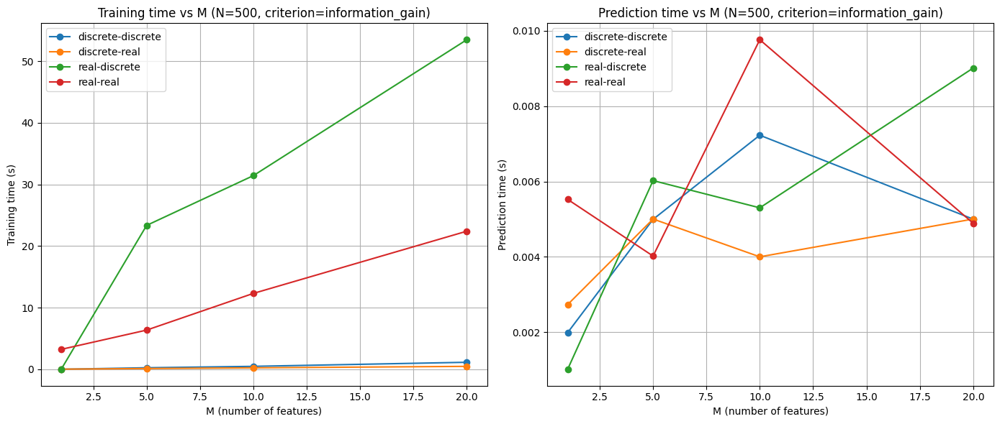

Plots for gini_index:

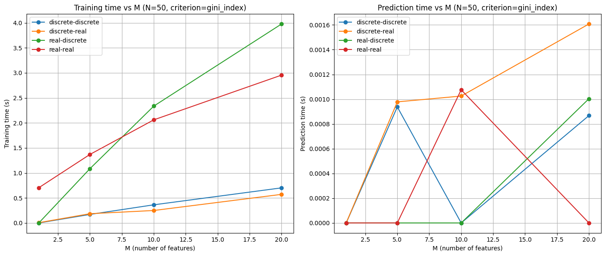

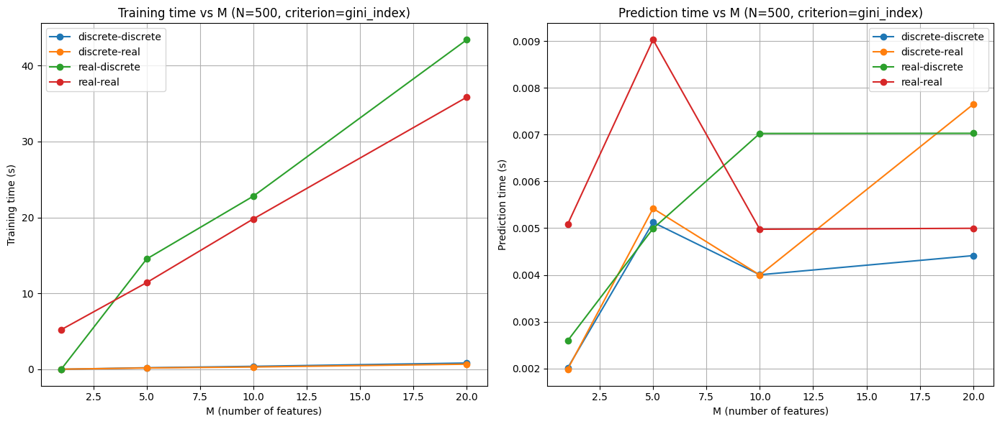

The depth of a decision tree is generally on the order of **O(log N)**, though in the worst case it can grow to **O(N)**.  

### Training Time  
The theoretical complexity of training a decision tree is **O(M·N·log N)**, where *N* is the number of samples and *M* is the number of features.  
- The plotted results confirm this behavior: training time increases nearly linearly with both *M* and *N*, in line with the expected complexity.  
- This is expected, since the **N·log N** curve is also close to linear.  

### Prediction Time  
The complexity of predicting a single sample is proportional to the **tree depth**. For balanced trees, this is typically **O(log N)**.  
- In practice, prediction may terminate earlier if a leaf node is reached before the maximum depth, leading to reduced times.  
- The plots show that prediction time rises with *N* (log N pattern), but remains almost constant with respect to *M*.  

### Conclusion  
The observed results align with theoretical expectations:  
- Training times follow **O(M·N·log N)**.  
- Prediction times follow an overall **O(log N)** trend, increasing with *N* but largely independent of *M*.  
